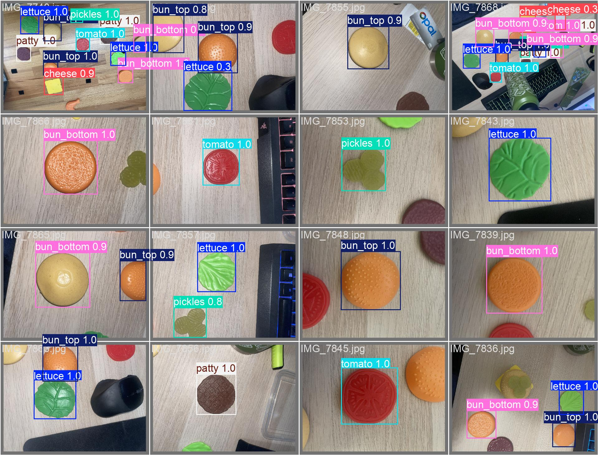
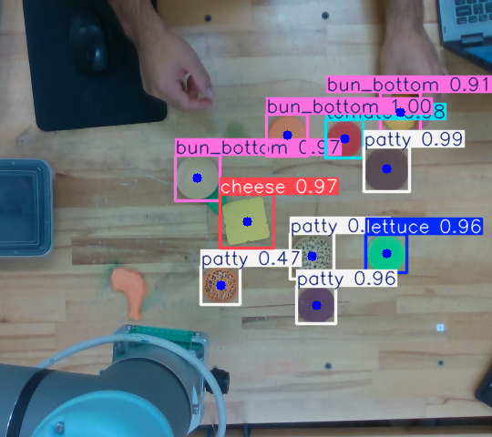
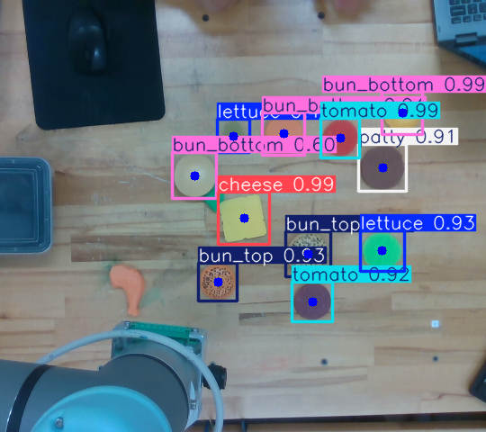
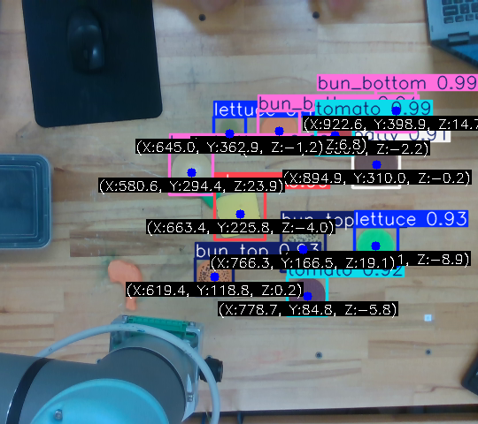
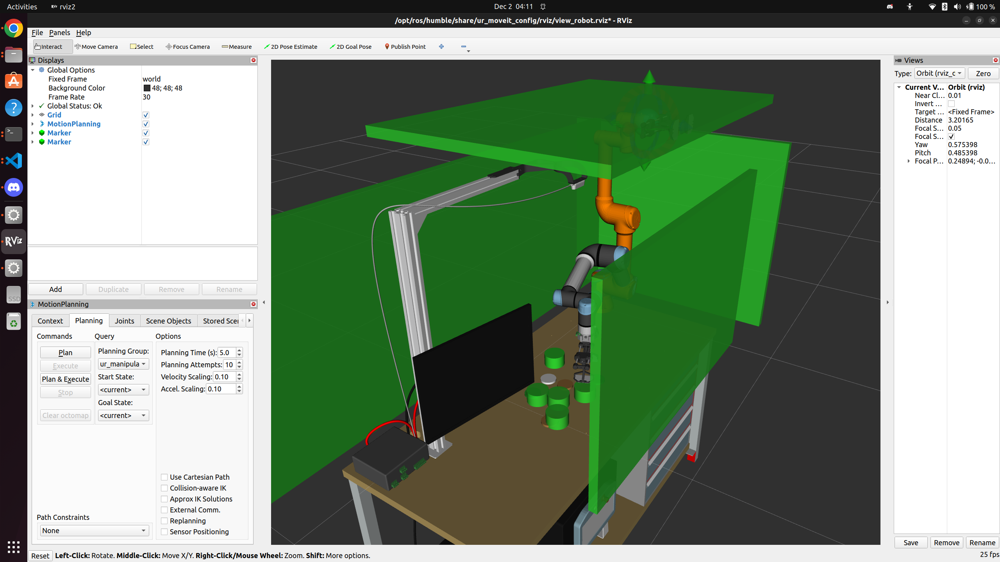
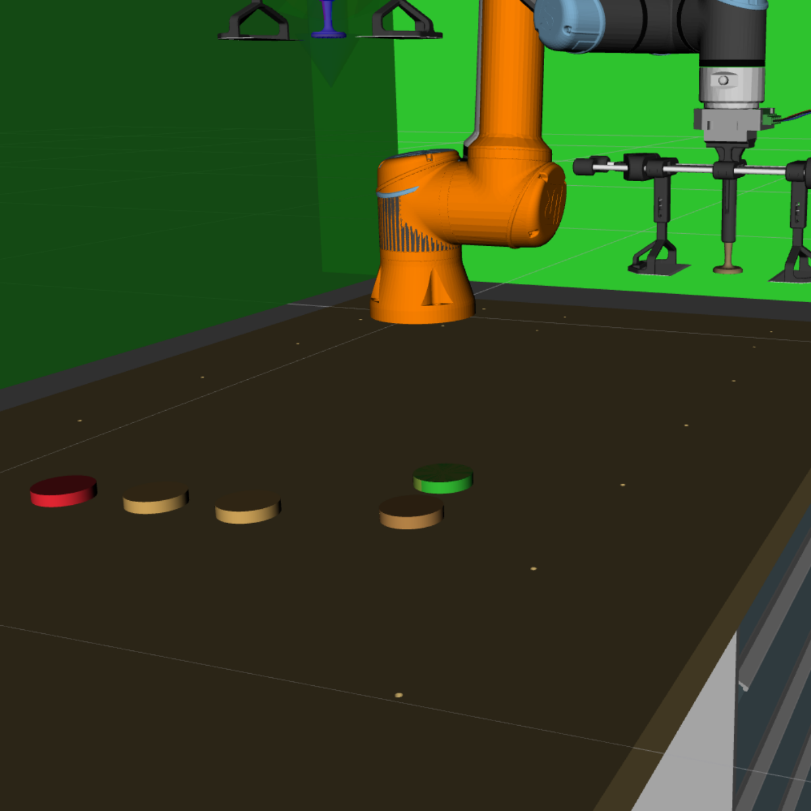
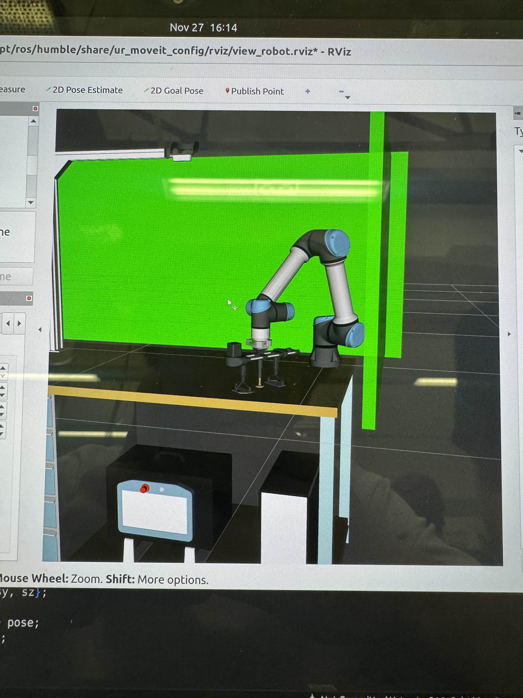
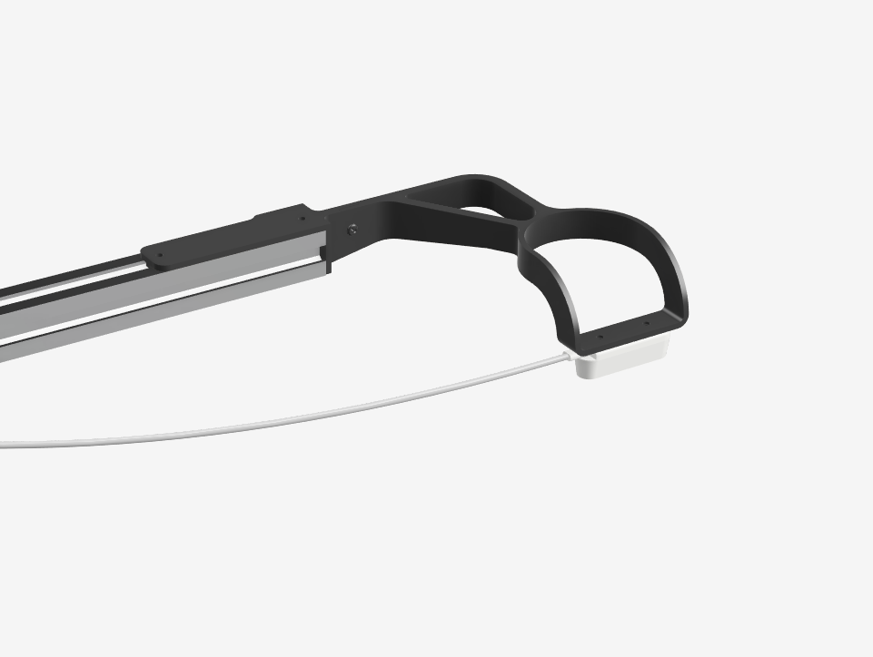
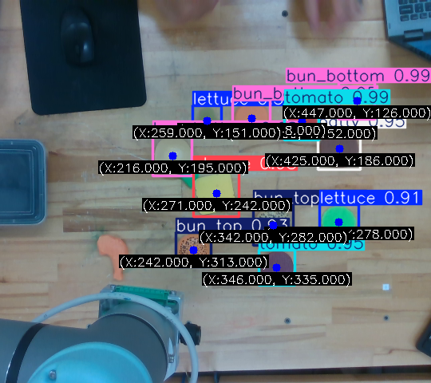

# MTRN4231 Group Project - Burger Bot

## Table of Contents
- [Project Overview](#project-overview)
- [System Architecture](#system-architecture)
- [Technical Components](#technical-components)
- [Installation and Setup](#installation-and-setup)
- [Running the System](#running-the-system)
- [Results and Demonstration](#results-and-demonstration)
- [Discussion and Future Work](#discussion-and-future-work)
- [Contributors and Roles](#contributors-and-roles)
- [Repository Structure](#repository-structure)
- [References and Acknowledgements](#references-and-acknowledgements)

## Project Overview

The burger bot project aims to address the task of automating the fast-food industry by providing a burger assembly robotic manipulator which is more cost effective than current industry solutions. Employees are expensive, unreliable and take time to train. These are costs that can be mitigated through automation because a robotic solution to burger assembly is mostly a onetime cost bar electricity and periodic maintenance. These recurring expenses, however, are much lower than a team of employees’ wages. A robotic solution is consistent, accurate, efficient and can work 24/7. These benefits aim to aid fast food restaurants such as McDonalds, Hungry Jack’s, Wendy’s and any other burger restaurant which would like to enter business negotiations.

Burger and sandwich assembly is a significant technical issue faced by industry with minimal solutions currently available. Many require assembly lines with multiple robotic manipulators with end effectors specialised to one or two ingredients at a time. This inflates cost for restaurants who are fed up with their unreliable employees and looking for a robotic solution. This project proposes an end effector which can manipulate any foreseeable burger ingredient, reducing the assembly line to a singular robot per burger.

The solution integrates computer vision, path planning, a custom-built end effector and closed-loop control to solve this problem. As a general overview of functionality the below operation pipeline explains the solution.

- The functionality starts from the end-user who inputs their desired menu item. This has information about the correct ingredients and the order for stacking and is fed into the brain. 
- Within the restaurant, ingredients can either be fed into the robot’s range via conveyor belt in any configuration but in this simplified case they are situated randomly on a table within range of an RGB-D camera. 
- The solution uses a YOLO model for its computer vision trained on all possible ingredients + false ingredients to improve robustness in detection. By running the YOLO model on the camera feed the pixel locations of each ingredient’s centroid can be found as well as what ingredient is being detected. This is then transformed into coordinates relative to the UR5e’s base-link by comparing the locations of the camera and the UR5e base.
- The brain uses this information to determine the location of the first item in the stack for the end-users desired menu item and calls moveit utilising cartesian path planning to go to that location.
- Once the gripper is lowered over the ingredient, the brain calls the Arduino control node to send a close command over serial to the Teensy 4.1 which controls the end-effector.
- Moveit is then called again to send the TCP back to the defined home location and releases the gripper to add the ingredient to the stack.
- This is repeated for every ingredient in the menu item, with the locations of food items being dynamically updated during operation.
- During the entire operation every movement is visualised within Rviz, along with safety planes, environment objects and collision boxes.
The solution includes extensive error checking, but this is covered more in-depth within the system architecture and technical components sections.

### Solution Video:

Please see below a video of the manipulator completing a full control loop. This video includes a representation of many of the possible edge cases and displays how this solutions brain node is robust enough to handle them.

- 0:00:04 - Functionality for ensuring the end effector grippers do not crush other “non-target” ingredients on the table as it lowers by rotating the TCP.
- 0:00:18 - Safety plane integration with path planning to ensure ingredients are in a pickup able location without colliding with safety planes (Front).
- 0:00:23 - Singularity prevention for when ingredients are out of reach, integrated into closed loop control to update target location when ingredient is moved within suitable range.
- 0:00:31 - Recipe adherence, the robot will only pick up the necessary ingredients on the table to follow an inputted recipe.

**High quality video (YouTube):** https://youtu.be/2kIR_RqGSEc

https://github.com/user-attachments/assets/b9df1b45-9737-490c-970d-db6d626eccda


## System Architecture

### Diagram of ROS2 nodes, topics, services and actions (RQT Graph):
> These RQT graphs were taken at different points of operation for the solution and show the interaction between nodes as the solution runs.


### Package-level architecture diagram showing node interactions and topics:


### State-machine diagram which portrays the closed loop operation of the system:


### Description of the function of each node:

**1. Arduino_controller Package**
&rarr; gripper_serial_node: 

- Communicates with the teensy 4.1 over a serial port to control the end effector using open and close commands.

**2. Brain Package**
&rarr; brainNode: 

- Central node for the entire system coordinating everything. It:
    - Receives user input as a list of ingredients in the correct stack order
    - Reads perception outputs for available ingredient positions
    - Commands the UR5e arm to various positions to a follow strict trajectory
    - Sends open/close commands to the gripper
    - Handles edge-cases and overall closed loop operation with a state machine
    - Publishes location of collision objects to RVIZ for dynamic collision detection

**3. moveit_path_planner Package**
&rarr; moveit_path_planning_action: 

- Implements a ROS action server that provides asynchronous motion-planning to handle when the brain node requests a motion plan to a target pose
- Creates collision objects recieved from the brain node
- Interfaces with moveIt to generate collision free path planning

**4. perception Package**
&rarr; yolo_vision: 

- Runs object detection using YOLO and publishes the detected ingredient names and positions.

**5. perception_markers Package**
&rarr; ingredient_markers_node: 

- Subscribes to vision outputs and publishes the ingredients as markers for visualisation in Rviz.

**6. user_input Package**
&rarr; inputNode: 

- Captures user inputs for menu items and identifies the correct recipe.
- Sends the recipe as an ingredient list to the brain node.


### Custom message types and interfaces:

**1. Custom Messages:**

- IngredientPos.msg: Contains a particular ingredients ID (i.e. lettuce, tomato etc.) and its position in space (x, y, z).

- Ingredients.msg: An array of IngredientPos messages for all ingredients on the table.

**2. Custom Interfaces:**

- GripperServer.srv: Is used for communication with the end effector. Requests a command for the end effector “o”=open or “c”=close and responds with success state and a message.

- Movement.action: Is used for sending move commands to moveit. Requests a command, an array for the pose and a constraints identifier “0” = unconstrained, “1” = orientation constrained. Responds with a success state and has status feedback periodically.

- OrderRequest.action: Is used for inputting a desired menu item. Requests a string array of ingredient names and responds with a success state and has status feedback periodically.


## Technical Components

### Computer Vision 
Computer vision is critical to the functionality of our system. It is used to:
- Identify ingredients
- Obtain the 3D position of the ingredients
- Generate collision objects
- Visualise the ingredients in RVIZ

#### Object Detection
To assemble a burger the system needs to identify the correct ingredients corresponding to the recipe for the requested burger. We considered colour masking and using the shape to identify the ingredients. However, due to past experience of each of the team members this was not used due to its unreliablity and is not robust against changes in environment such as lighting conditions. 

In search of a more robust computer vision strategy we adopted the Ultralytics YOLO model to perform transfer training for a custom model that is trained on fake food ingredients. This invovled taking over 200 images that each needed annotation. Two seperate YOLO models were trained.

**YOLO model 1**

This model was trained on over 100 images and worked very well for out first time ever using YOLO. It correctly identified ingredients with over 95% confidence at close range. This can be seen here from the validation data given to the model after training. 



This confidence dropped to around 50%-80% when connected to the realsense camera and was misidentifying items. For example a computer mouse was being picked up as a patty and could not differentiate between top and bottom buns. The image below shows the model misidentifying ingredients using the realsense camera.



Even though we were experiencing issues with the model, we were satisfied with the performance due to where the camera would be mounted on the robot arm so that close up images could be used for verification. Since the model performed well close up, we were confident this solution was viable. However, upon further inspection the control loop was redesigned to keep efficiency a priority due to the target customer. A camera on the robotic arm would have forced the arm to return to a high overseering position to view the entire workspace before acting. This would have reduced the efficiency by at least 30%. Thus, the camera mounting position was moved to a fixed birds-eye view position over the robot. This meant close up verification was no longer needed and retraining of the model was required to address the issues.

**YOLO model 2 (black seeds)**

It was suggested by Mitch Torok (A tutor for the course) to train with at least 50% of the data with little to no ingredients so that the model knew not to identify random objects as ingredients. Additionally, drawing "black seeds" on the top buns to help differentiate between top and bottom. This significantly helped the identification of the ingredients in practice. The confidence was still lower than we would have liked (we were aiming for >95%) but random objects in the scene were no longer identified and a strong differentiation between top and bottom bun was achieved.



### 3D Positions
The YOLO model was trained to generate bounding boxes around identified ingredients. These bounding boxes could be used to identify the centroid of the ingredient in pixel position. Using these pixel coordinates we could also obtain the depth (straight line distance) from the camera to the ingredient using the /camera/camera/rgbd topic.

Then using the camera intrinsics published by the realsense package. A pinhome formula could be used from the focal length and centre line position to create a mapping from pixel position and depth to real 3D coordinates in the camera frame. The image below displays the result of this calculation.


However, these positions could not yet be used by the MoveIt node since the goal positions required the ingredient positions to be in the base_link frame. A static transformation from the camera_link to the base_link was required to successfully send goal positions. The image below shows the conversion of ingredient positions from the base_link frame of the UR5e.



In practice when moving the robot to pick up ingredients it did experience offset errors. We could not identify whether it was due to skew of the camera or inaccuracies in the static transformation for the camera position. Thus, we manually tuned the ingredient positions using manual offsets calculated by comparing the computer vision position against the moveIt arm position and applying an average.

### Collision Objects
Dynamic collision objects are required so that the end effector does not squish other ingredients and also ensures reliable picking. To dynamically create the collision objects the positions of the ingredients are published so that the moveIt node can subscribe to the topic and publish the collision objects appropriately. All collision objects are fixed cylinder sizes and had to be tall enough to collide with the end effector collision box. All ingredients are considered collision objects except for the target so that the end effector can interact with it without triggering a collision.

Below is an image of the collision objects in the scene in RVIZ (the green cylinders are the collision objects)



### Visualising Ingredients in RVIZ

The perception marker node is responsible for taking the published ingredient positions from the perception node and creating markers at those positions. RVIZ reads these markers and displays it in the scene. This is shown in the image below. 

- red = tomato
- green = lettuce
- light brown = bun top
- dark brown = bun bottom



### Custom End-Effector
**Photos, Renders and Engineering Drawings**

- Photos:


- Renders:


- Engineering Drawings:


**Assembly Details** 

- Instructions:
  
      1. Before assembly you will need:
          - 5 M3x20, 6 M3x10, 4 M3x4, 1 M3x50 screws.
          - 1 M3 Wingnut.
          - 3 Bearings w/ 19OD & 6ID.
          - 2-part epoxy resin.
          - 600mm x 6.3mm solid aluminium or titanium round bar.
          - 5mm width timing belt replacement for 3D printer.
          - 0.6mm thick stainless steel sheet.
          - 4 9mm x 40mm low stiffness springs
          - 1 NEMA17 0.56Nm holding torque 1.7A 12V Stepper Motor
          - 1 DRV8825 or A4988 stepper motor driver
          - 1 100uF electrolytic capacitor
          - 1 Teensy 4.1 Microcontroller
  
      2. 3D print all parts which are not listed above.
  
      3. Cut aluminium rods into 2 293mm lengths and slide them into the two slots on the belt tensioner bracket.
  
      4. Slot the head of the M3x50 screw into the mount point on the coupling for the tensioner mechanism and slide onto the two rods from the unobstructed end.
  
      5. Slip the screw side of the M3x50 screw through the central hole on the belt tensioner bracket and fasten loosely with the M3 wingnut.
  
      6. Look for circular slots which fit the bearings on the 3D printed components and press fit them in place.
  
      7. With the bearings in place grab the timing belt drive gear with two male shafts and slot into the bearing within the tensioner coupling.
  
      8. Slide the large NEMA17 drive bracket onto the unobstructed side of the 2 guiderails, this should include a bearing.
  
      9. Slot the timing belt drive gear with one male shaft and one female d-profile into the bearing hole.
  
      10. Use the 4 M3x4 screws to fix the faceplate of the NEMA17 to its mounting bracket part.
  
      11. Measure a length of timing belt such that it loops around the two drive gears on opposite ends of the guiderails and meets itself without overlap or gap.
  
      12. Fix the mounting bracket holding the NEMA17 onto the drive bracket and slot the drive shaft through the d-profile in the belt drive gear. Fix this down with 2 M3x20 screws
  
      13. Similarly, slot the lid for the tensioner coupling in place and fasten with 2 M3x10 screws.
  
      14. Flip the entire structure upside-down and grab one of the top parts for the gripper jaws which should have a jagged profile matching the timing belt.
  
      15. Slot the free ends of the timing belt into this jagged profile and fix in place with a suspension sheath and 2 M3x10 screws.
  
      16. Slide this along the guide-rails until its flush with the NEMA drive bracket and tighten the wing nut to tension the timing belt.
  
      17. With the other suspension sheath and head, fix it in place such that it is flush with the tensioner coupling instead. Ensure the jagged profile is on the opposite side of the timing belt.
  
      18. Place the central UR5e connector on the guiderails and using both of the gripper heads, slide them into the center of the guiderails.
  
      19. Mix the 2 part epoxy resin and apply to the guiderails & inner surface of the central column, do not apply glue to the sliding gripper jaw heads.

      20. Press the suspension sheath for the holding pick into the epoxied central UR5e connector to fasten this column perfectly in the center of the guiderails.

      21. Once dry, place 2 springs into the central sheath and 1 spring into each of the jaw sheaths.

      22. Slide the holding pick in place and screw through the hole with 1 M3x20 screw to provide a blocker for the spring.

      23. Do a similar process for the two side jaws ensuring that the gripper cages face with the mouths inwards.

      24. Cut the stainless steel sheet with tin snips into 2 spatula shapes using a paper template to ensure consistency.

      25. Mix some more epoxy and apply to both the gripper cages and the spatulas and fix together while aligning the profiles.

      26. Once dry your end effector is complete.

      Next Steps:
      Follow the breadboard circuit diagram below and documentation for the particular motor driver you own to connect the NEMA17 to the Teensy 4.1.


- Exploded Render:


**Control Overview and ROS Integration Details**
- Control Overview:
  - The end effector is controlled by rotating the timing belt with a NEMA17 stepper motor. The gripper jaws are attached to opposite sides of the timing belt and guided by guide rails so that they can open and close by changing the direction of the stepper motor. The stepper motor is controlled by a teensy 4.1 microcontroller along with a DRV8825 stepper motor driver which handles heat dissipation and current limiting. The circuitry for this interaction can be seen below. The teensy is programmed to receive commands over a serial port with "o" referring to open and "c" referring to close. An open command will step the stepper motor 1 and 1/3rd rotations clockwise while a close command will do the opposite. This step value correlates to the amount of travel needed for the jaws to fully open and close. There is also functionality for handling unknown commands in which case nothing will occur. Importantly, when not receiving commands the stepper motor will hold its current state.
  
- ROS Integration:
  - The brain node sends service requests for opening and closing, the arduino_controller package is then used to handle these requests with service responses to the brain and sends the string "o" or "c" over the serial port /dev/ttyACM0 which represents the teensy serial port. The teensy then handles the serial input.

      
- Breadboard Circuit Diagram:


### System Visualisation 
System visualisation for the UR5e system was performed using RViz2, which provided a real-time representation of the robot, the end effector, and the surrounding workspace. RViz2 displayed continuous joint state updates from the robot driver, allowing us to remotely monitor the robot’s physical configuration and verify that the UR5e matched the expected kinematic state during motion execution.

A detailed URDF/Xacro model was constructed to accurately represent the physical setup. The end effector was imported as a colour OBJ mesh, giving a realistic and easily interpretable visual model that made orientation, approach direction, and contact surfaces clear. A separate URDF was created for the table and workspace environment, and both components were combined in a master Xacro file. The end effector was rigidly attached to the robot by defining a fixed joint between tool0 and the end-effector link, ensuring correct alignment within the TF tree.

RViz was also used to visualise the MoveIt planning scene, including planned trajectories, goal states, and collision geometry. Collision boxes were added around the table and the environment, ensuring that MoveIt respected workspace constraints during path planning. A partial collision box was also placed around the end effector, intentionally leaving the underside clear so that the tool could safely make contact with the table when picking up ingredients while still preventing unwanted collisions elsewhere.

The visualisation additionally allowed us to validate the TF frame structure, ensuring correct transforms between the UR5e links, the tool frame, and the environment frames. RViz also displayed the “ghost robot” showing planned trajectories before execution, providing an essential safety check to confirm that paths were valid and collision-free before being sent to the real hardware.

Overall, the visualisation system demonstrated the robot’s kinematic configuration, collision-aware planning environment, object interactions, and trajectory execution, giving a complete and accurate representation of the system and significantly improving safety and reliability during development.


#### Rendered Table for Visualisation


#### Robot and Environment Visualisation

<p align="center">
  
  
</p>

### Closed-Loop Operation 
The system operates in a closed-loop structure where perception, planning, and execution continuously update each other to ensure robust behaviour in a dynamic environment. At runtime, the ingredient positions on the table may shift, and the robot must adapt to these changes. This is achieved by allowing the perception system to update ingredient poses and their corresponding collision objects whenever the robot returns to the startState. This constraint ensures the camera maintains a full and unobstructed field of view; otherwise, the arm could occlude ingredients and cause incorrect or incomplete scene updates.

Once a new set of ingredient positions is available, the system regenerates the corresponding collision objects. These collision objects represent both the physical ingredients and safe separation zones to prevent crushing or collisions. The robot can then respond to any changes in ingredient layout without requiring manual resets or reconfiguration.

MoveIt is responsible for generating collision-aware trajectories based on the updated scene provided by perception. After the planning scene has been refreshed, MoveIt selects a target ingredient and computes a path to a predefined hover pose directly above it. This staging pose allows the robot to safely approach ingredients even in cluttered environments.

From this hover position, the robot attempts a secondary plan to lower the end effector and perform the pickup. If this descent trajectory is invalid due to nearby collision objects, the system triggers an adaptive re-planning process. The TCP orientation is rotated around the z-axis in 17° increments, and for each new orientation MoveIt attempts to compute a feasible descent path. This continues up to approximately 170°, providing a wide range of alternative approach angles. This can be seen in action in the embedded video at the top of this report [here](#solution-video).

If no valid plan can be found after exhausting all orientations, MoveIt commands the robot back to the home position. The perception system then performs another scene update, and a new attempt is made based on the refreshed workspace information. This procedure ensures robustness in dense or dynamic ingredient layouts and prevents the robot from committing to unsafe motions.

This MoveIt-based planning strategy enables reliable, closed-loop adaptation by continuously integrating updated perception data with flexible, collision-aware motion generation.

#### UR5e Arm Control (Moveit)
The implementation of moveit for our solution had 3 requirements:
- The TCP must face downwards at all times.
- The robot must avoid all collisions, including ingredients and the environment.
- The motion must be efficient.

To fulfil these requirements a combination of joint constraints and Cartesian path planning was implemented.

Cartesian planning is ideal for ingredient pickup because it naturally creates predictable and direct motions. When MoveIt interpolates a Cartesian path, it maintains the robot’s orientation throughout the motion, which allows us to keep the TCP pointing straight down toward the table. This makes ingredient pickup reliable and prevents the robot from sweeping sideways into nearby objects.

MoveIt also continuously checks every small step of the planned Cartesian path for collisions. This includes the table, walls, the end effector’s collision box, and the dynamically updated ingredient positions. If any part of the descending motion would intersect with a collision object, MoveIt rejects that path. The system then attempts the same motion again with a slightly rotated wrist orientation, giving the robot multiple possible approach angles to safely reach the ingredient.

By using only Cartesian planning, the robot’s movements remain intuitive, consistent, and efficient. Every motion is either a straight-line approach, retreat, or reposition, which makes the behaviour easy to predict and reduces unnecessary robot movement. This approach, combined with continuous collision checking and live perception updates, allows the robot to safely and reliably operate in a cluttered and changing workspace.


## Installation and Setup
### OS and ROS2
The system runs best on native linux machines specifially development for this project was conducted in Ubuntu 22.04.5 LTS. Regardless of operating system, the ROS2 Humble distro is required for operation. Please follow the official installation guide for further details [here](https://docs.ros.org/en/humble/Installation.html).

### Software Installation
All of the following installation instructions will assume that you are using a linux (debian) based machine so please modify instructions according to your specific machine.

Clone the repository using either HTTPS or SSH

HTTPS
```
git clone https://github.com/jacobRaw/MTRN4231_burger_bot.git
```

SSH
```
git clone git@github.com:jacobRaw/MTRN4231_burger_bot.git
```

Install python dependencies from the requirements.txt at the root.
```
pip install -r requirements.txt
```

Install the following ROS packages
```
sudo apt-get install ros-humble-ur
sudo apt install ros-humble-moveit
sudo apt install ros-humble-realsense2-*
sudo apt-get install librealsense2-dkms librealsense2-udev-rules librealsense2-utils
```

Source the ros distro by choosing the correct setup file that corresponds to the shell that is running on your machine (most UNIX systems will be using bash so you should be able to follow the instructions below), change directories into the src directory and only build the custom_interfaces package. This is necessary because other packages depend on custom_interfaces to build.
```
source /opt/ros/humble/setup.bash
cd src
colcon build --packages-select customer_interfaces
```

After building custom_interfaces, source the newly created install/setup.bash file and build the entire software stack.
```
source install/setup.bash
colcon build
```

At this stage everything will run but to obtain accurate positioning from the camera frame the static transform broadcaster will need to be modified in src/launch/perception.launch.py. Please refer to the hardware setup ([here](#camera)) to understand how your camera should be mounted before modifying the transformation values.

### Hardware Setup
This section will outline how to setup the camera, teensy, end effector and connecting to UR5e.
### Camera
The computer vision has been designed to look down on the workbench as a birds eye view. This meant we had to create our own bracket mounting system that can be seen in the models and demonstrations. The offset of camera from the base of the UR5e for our setup is x=0.61m, y=0.2305, z=0.915, yaw=0, pitch=0, roll=3.14 but these values will need to be modified if attempting to recreate our solution. An model of this camera mount can be seen below.



A realsense D435 camera is required, this camera measures both RGB, pixel coordinates and depth. The realsense package downloaded during software installation uses an official ROS package by realsense to read data from the camera. It is as simple as plugging in the camera into a USB port on your machine and running the perception launch file as such.

```
ros2 launch perception perception.launch.py
```

### Teensy 4.1 & End Effector
Setting up the teensy is simple, if you successfully followed the wiring diagrams shown [here](#custom-end-effector). Then connect the arduino 12v plugs into the workbench power supply and the logic control inputs to send the serial commands through to the UR5e. The Teensy must also must be plugged into your machine throughout operation so that commands can be sent over serial to the teensy.

Once successfully assembling the end effector as described [here](#custom-end-effector). Then the end effector just needs to be plugged into the socket at the end of the arm and mounted simply in the mounting clamp in-built to the arm.

### Connecting to UR5e
An ethernet cable is required to connect to the UR5e but since the machine we used for demonstration did not use an ethernet port an ethernet to USB-A adapter may also be required depending on machine specifics. Once connecting to the UR5e via ethernet network settings must be configured. For the robots at UNSW teaching labs the following networking settings must be set on your machine to connect.

```
IP: 192.168.0.100, subnet mask: 255.255.255.0
```

Finally, on the teaching pendant the robot must be set to "manual" mode and the program must be set to run over the configured IP address above.

### Common Issues/Troubleshooting
More often than not when installing, building or trying to run the system, the terminal has not been sourced. Always run one or both of the following commands before trying anything else since this a common culprit.

```
source /opt/ros/humble/setup.bash
source install/setup.bash
```

If choosing to extend our solution and would like to modify any of the existing code sometimes it may be necessary to do a fresh rebuild if there is legacy install or build files that are conflicting. It is safe to delete the build, install and log directories generated by colcon build since they are files only used at run time and will not delete any source code.
```
rm -r build log install
colcon build --packages-select custom_interfaces
colcon build
```

## Running the System
To run the entire system you simply have to run the single system.launch.py file in src/launch directory. There is two ways to launch the system, one for the real robot and the other simulated.
Run the below commands in the src directory.

Simulated/fake robot
```
ros2 launch launch/system.launch.py
```

Real robot: The robot_ip may need to be modified depending on the IP address set for your UR5e.
```
ros2 launch launch/system.launch.py use_fake_hardware:=false robot_ip:=192.168.0.100
```

For debugging or testing perception and moveit nodes in isolation please follow the instructions below.

### Computer vision (perception)
This will run the perception node, perception markers node and the realsense package. There is no observable output from these nodes on the terminal but if the node is running correctly a window will appear with the live camera footage running the YOLO model and will annotate the image at run time. Please refer to the image below.
```
ros2 launch perception perception.launch.py 
```


### Arm Action Server
This will launch the moveit action server and similarly to the system.launch.py file can be launched as a fake robot or real robot.
Fake Robot: Only launches the moveit action server and opens RVIZ.
```
ros2 launch launch/arm_server_launch.py
```

Real Robot: Launches both moveit action server, arduino controller and opens RVIZ
```
ros2 launch launch/arm_server_launch.py use_fake_hardware:=false robot_ip:=192.168.0.100
```

Since this node can be run independtly from the rest of the system, it can also receives CLI commands. This was very useful for debugging and testing moveit in isolation without the brain node. An example action server goal request using cartesian planning is given below for the home position we use for our demonstration.
```
ros2 action send_goal /moveit_path_plan custom_interfaces/action/Movement "{command: 'cartesian', positions: [0.15, 0.490, 0.3, 3.1415926536, 0.0, -1.5707963268], constraints_identifier: 'FULL'}"
```

The following command is also useful to send the robot to the home position without any constraints using joint planning. This is useful for debugging moveit as well to relax constraints since moveit can be difficult to work with.
```
ros2 action send_goal /moveit_path_plan custom_interfaces/action/Movement "{command: 'joint', positions: [0.15, 0.490, 0.3, 3.1415926536, 0.0, -1.5707963268], constraints_identifier: 'NONE'}"
```

### Troubleshooting
- When working with the real robot it was a common issue to forget to reset/play the program on the robot to allow your machine to communicate with the UR5e. This simply requires intervention with the teach pendant.

- Another issue when working with the real robot is forgetting to set the use_fake_hardware and robot_ip arguments for the launch files. A quick way to check if this was the issue check the robot pose in RVIZ. If the simulated program is running, all links would be pointing vertically up.

- If no window appears for the perception node it could be due to the camera not being plugged in, if this is not the issue try running the realsense package in isolation and verify the camera feed is being published in rqt. 


## Results and Demonstration
The following results summarise the performance of our system and assess how effectively it met the design goals through measured accuracy, repeatability, and execution speed.

### Design Goals
- Accurately detect ingredients
- Maintain safe, collision free robot motion
- Achieve consistent ingredient pickup
- Complete task within reasonable time

### Performance Summary
| Design Goal | Achieved? | Evidence |
|-------------|-----------|----------|
| Accurate detection | Yes | YOLO confidence 0.82–0.99 |
| Safe motion | Yes | 0 collisions in 10 cycles |
| Repeatability | Partial | 9/10 successful cycles |
| Time | Yes | < 1.5 minutes |

### Performance Against Design Goals

Our final solution successfully met the majority of the design goals through a combination of reliable perception, safe motion planning, and repeatable execution. Ingredient detection was achieved using a YOLO-based perception system that was validated on over 100 labelled images prior to integration. This allowed the model to handle variations in lighting, occlusion, and ingredient orientation, resulting in stable real-world confidence scores between 0.82 and 0.99.

Safe, collision-free robot motion was maintained by dynamically updating the MoveIt planning scene with live ingredient positions. This ensured that all planned trajectories respected both the environment and nearby ingredients. Cartesian motion planning played a key role here, producing predictable, straight-line paths that maintained the required downward TCP orientation while avoiding unintended contact with surrounding items.

The system demonstrated strong repeatability, achieving 9 successful ingredient pickups out of 10 full cycles. The single failure occurred under an unusually cluttered layout that restricted available descent angles, demonstrating a limitation of the workspace rather than the control logic. Despite this, the system consistently recovered through its retry mechanism and maintained stable operation across repeated runs.

Task efficiency was also achieved, with each full cycle completing in under 1.5 minutes. Fast perception updates and direct Cartesian movements contributed significantly to this performance.

Overall, the combination of robust perception testing, continuous collision-aware planning, and adaptive retry behaviour enabled the system to perform reliably and closely align with its intended design goals.


### Video Documentation
> Please see below a few video's of the system being tested for robustness in particular areas. The video in the project overview shows the fully working solution.

End Effector Test: https://youtu.be/JZK5y5WVghE

Computer Vision & Closed Loop Test: https://youtu.be/MXHHu9Mg7A8

Ingredient Collision Robustness Test: https://youtu.be/D7P5NxirLQY

### Evaluation of System Robustness, Adaptability, and Innovation

**Robustness**
- The solution exhibits many areas of robust operation. Namely, the ability for the moveit implementation to repeatedly move the UR5e to accurate coordinates and pose without unexpected behaviours is a major requirement and something that this solution does extremely well. 
Upon implementing the cartestian path planning method for moveit, any innacuracies or failures were completely mitigated. This greatly benefits robot safety with the safety planes now acting as backup precautions instead of the main constraint upon path planning. The current moveit
 implementation could very easily integrate into the desired fast-food industry and support accurate and safe path planning.

- Another strong area for this solution is the end effector itself, it provides significant repeatability, although it has been observed to fail on particularly rough parts of the UR5e table due to the spatula-grippers sliding along the table and getting caught on uneven surfaces or bolt holes. 
However, this is a relatively rare occurance and could be mitigated through further development and better manufacturing processes. The end effector is capable of manipulating any of the proposed ingredients, including extremly thin ingredient (~1mm thick) which was one of the major design requirements.

- The computer vision solution using YOLO works very well, by training the model on both the desired ingredients and false objects, it can now accurately identify ingredient types and positions as well as eliminate any non-ingredient from the selection. It updates extremely fast and exhibits high confidence levels. 
An area in which this solution can struggle is when the UR5e table is not made from darker wooden panels as this was the environment on which the YOLO model was trained. This yields lower confidence levels and some flickering behaviours, especially for smaller ingredients. The closed loop solution is capable of handling
this to an adequate extent, however, and will wait until the ingredient becomes available upon which the production will continue.

**Adaptability**
- The end effector is extremely adapatable and offers an easily scalable solution towards larger ingredients and a more food safe material selection (simply swap out the spatula grippers by unscrewing them). It also has the capability to adapt to errors within the solution through its suspension system which protects it from
crushing if it were to be forced into the UR5e table.

- The closed loop implementation offers a high level of adaptability to environmental changes, however, it can be slow to do so due to solution constraints involving the camera feed being blocked by the UR5e during the pick and place state. This means that updates to ingredient positions can only occur at the home state which
has been specifically chosen to provide an unobstructed view for the camera. Overall though, the major drawback is speed and the closed loop solution works for many foreseeable circumstances. This issue would likely need to be addressed and improved upon for industry integration. The closed loop implementation addresses a large number of edge cases which would otherwise cause failures or breaks to the system, some of which are clearly outlined in the demonstration video.

**Innovation**
- There are currently very few industry solutions for sandwich building robots due to the complexities of manipulating these sorts of objects. Burger ingredients have a high level of variability and so current methods often employ multi-stage, assembly-line type solutions with end-effectors only suitable to one or two ingredient
types per-robot on the line. This is an inneffective solution for fast food chains which often do not have a large amount of space to install such a system at high cost. The proposed end effector is designed to handle any forseeable burger ingredient, with scalability and ingredient care in mind. The end effector solution has proven to successfully contribute to this design area by fully assembling burgers with ingredients of varying diameter, thickness, rigidity and softness. However, wet ingredients are still yet to be tested even though its designed for it.

- Another area of innovation was the dynamically updating ingredient collision box implementation. This successfully solved a unique problem with the end effector design, in which, the spatulas can drop onto other ingredients during pick operation, thereby jamming the system or causing unpredictability. By applying tall collision boxes to all ingredients except for the target, the moveit path planning package can be used to return failed path plans if the end effector would crush an ingredient. The TCP can be rotated until a valid path plan is found (the end effector is clear below) and operation can continue. The solution to utilise innate path planning methods in moveit to solve an otherwise complex mathematical task adds to the innovation of this project.


## Discussion and Future Work
**Major Engineering Challenges and Solutions** 
- One of the largest challenges with the design of the end effector was ensuring that ingredients could be reliably released by the jaws at a repeatable location. Because the spatulas slide under the ingredients, when they re-open slight differences of friction and stickiness causes the ingredient to remain stuck on one side of the two gripper spatulas. This prevents reliable drop operation. To mitigate this, a centralised spring loaded holding pick featuring a studded base can be used to apply pressure from above while preventing lateral ingredient movement upon opening. This also applies force onto the burger stack to ensure ingredients are placed accurately and reliably. In addition, this implementation allows the end effector to be posed at any orientation, including fully upside down without ingredients slipping out.

- Moveit integration into the ROS solution posed a significant challenge with unrelaible path planning and unpredictable behaviours. The solution requires extremely accurate UR5e arm positioning to reliably stack burgers. The moveit issues were completely mitigated through using cartesian path planning which provides a reliable solution to this engineering problem.

- As discussed in the innovation section, there was an issue of ingredients being below the end effector as it lowered, if the jaws collided with these ingredients unintentionally it would cause significant failures to the solution. This was mitigated through adding collision boxes to all ingredients except the target to generate an accurate ingredient avoidance path planning solution.

- The resolution of the RGB-D camera was too minimal to allow for the side mounted computer vision implmentation. Because some ingredients are exceedingly small (pickles) the YOLO model could not accurately identify these ingredients from a far distance. To remedy this issue the camera was placed from above, giving a clearer view of the UR5e table. The camera mount was developed such that the camera was aligned with the centroid of the work area defined by the 10 table bolt holes.

**Future Improvements**
- Adding mold detection to YOLO and the ability to drop bad ingredients into a bin location. 
- The ability to change the stack location using aruco markers. 
- Adding a graphical user interface instead of just using the CLI. 
- Better smoothing of end effector spatulas to reduce the chance of them getting stuck.
- More efficient stacking by stacking from top to bottom and keeping the stack in the end effector. This removes having to go back to the stack location each time and instead the gripper can just jump between ingredients.

**Solution Novelty**
- The solutions novelty is mainly covered in the innovation section, however as an overview, the ability to delicately pick up soft objects is an interesting problem in robotics which is often solved through using pneumatic gripper solutions. A more classic take on gripper design with 2 jaws, integrated with the functionality to lift soft ingredients allows for an innovative approach to this design problem. The necessary collision planning that is needed to support this solution is not often faced by other pick and place systems and these unique qualities make the relatively aggressive Burger Master a novel and effective solution within the delicate robotics space.

## Contributors and Roles
**Jacob Rawung (z5406297) - Software/Control Engineer**
- Trained the YOLO model across two iterations
- Developed the brain node, user input and perception, key highlights:
    - Dynamic collision object generation
    - State machine with control feedback from perception
- Assisted in the development and integration with wider system for visualisation markers, arduino controller node and moveit path planner
- Maintained meeting minutes and managed task deadlines

**Reynold Chu (z5417921) - Mechatronics Engineer** 
- Responsible for developing the moveit solution:
    - Successfully implemented MoveIt to fulfil all motion-planning requirements
    - Designed a custom action interface enabling the action server to send motion commands to MoveIt
- Responsible for system visualisation:
    - Fully visualised the environment, UR5e and end effector
    - Applied collision objects and walls to avoid collisions

**Riley Hackett (z5417561) - Mechanical/Electrical Engineer & Investor** 
- Responsible for all CAD and end-effector development/assembly, Key areas:
    - Developed timing belt solution, belt tensioning mechanism and gripper suspension.
    - Fully modelled UR5e table for visualisation.
    - Produced a work-space centred RGB-D camera mount.
- Developed the arduino software for end-effector control as well as breadboard wiring.
- Sourced and funded all components and manufacturing for final end-effector solution and prototypes.
- Produced the pre-integration versions of the perception_markers and arduino_controller packages.


## Repository Structure
All the source code is kept inside the src directory whilst the readme and requirements file is left at the root to for initial setup. Inside the src directory each directory is a ROS package that contains at most one ROS node. Some directories are unique such as custom_interfaces, launch and robot_description directories which do not contain a ROS node but contain crucial components that ROS nodes depend on.
```
MTRN4231_burger_bot/
├── README.md
├── requirements.txt
└── src
    ├── arduino_controller
    │   ├── CMakeLists.txt
    │   ├── NemaCont2
    │   │   └── NemaCont2.ino
    │   ├── package.xml
    │   └── src
    │       └── gripper_serial_node.cpp
    ├── brain
    │   ├── CMakeLists.txt
    │   ├── package.xml
    │   └── src
    │       └── brainNode.cpp
    ├── custom_interfaces
    │   ├── action
    │   │   ├── Movement.action
    │   │   └── OrderRequest.action
    │   ├── CMakeLists.txt
    │   ├── msg
    │   │   ├── IngredientPos.msg
    │   │   └── Ingredients.msg
    │   ├── package.xml
    │   └── srv
    │       ├── GripperServer.srv
    │       ├── InputServer.srv
    │       └── MovementRequest.srv
    ├── launch
    │   ├── arduino.launch.py
    │   ├── arm_server_launch.py
    │   ├── brain.launch.py
    │   ├── input.launch.py
    │   ├── perception.launch.py
    │   ├── system.launch.py
    │   └── ur_startup.launch.py
    ├── moveit_path_planner
    │   ├── CMakeLists.txt
    │   ├── launch
    │   │   └── planning_server.launch.py
    │   ├── package.xml
    │   └── src
    │       └── moveit_path_planning_action.cpp
    ├── perception
    │   ├── package.xml
    │   ├── perception
    │   │   ├── black_seed.pt
    │   │   ├── burger_model.pt
    │   │   ├── __init__.py
    │   │   └── yolo_vision.py
    │   ├── resource
    │   │   └── perception
    │   ├── setup.cfg
    │   └── setup.py
    │   
    ├── perception_markers
    │   ├── CMakeLists.txt
    │   ├── launch
    │   │   └── display_markers.launch.py
    │   ├── package.xml
    │   └── src
    │       └── ingredient_markers_node.cpp
    ├── robot_description
    │   ├── CMakeLists.txt
    │   ├── meshes
    │   │   ├── EndEffector.mtl
    │   │   ├── EndEffector.obj
    │   │   ├── Table.mtl
    │   │   └── Table.obj
    │   ├── package.xml
    │   └── urdf
    │       ├── burger_bot.xacro
    │       ├── end_effector.urdf
    │       └── table.urdf
    └── user_input
        ├── CMakeLists.txt
        ├── package.xml
        └── src
            └── inputNode.cpp
```

### Arduino Controller
```
arduino_controller
├── CMakeLists.txt
├── NemaCont2
│   └── NemaCont2.ino
├── package.xml
└── src
└── gripper_serial_node.cpp
```
This package is reponsible for communicating to the teensy microcontroller over the serial port. It also contains the program that is run on the teensy to control the end effector. The node is interacted with by the brain via a service call which sends either 'o' or 'c' corresponding to either open or close.

### Brain
Contains the brain node source code that is responsible for interacting with the entire system, coordinating different componets.

### Custom Interfaces
```
custom_interfaces
├── action
│   ├── Movement.action
│   └── OrderRequest.action
├── CMakeLists.txt
├── msg
│   ├── IngredientPos.msg
│   └── Ingredients.msg
├── package.xml
└── srv
    ├── GripperServer.srv
    ├── InputServer.srv
    └── MovementRequest.srv
```
Custom interfaces contains all of the custom service, action and message types to allow for internode communication in ROS2.

### Launch
```
launch
├── arduino.launch.py
├── arm_server_launch.py
├── brain.launch.py
├── input.launch.py
├── perception.launch.py
├── system.launch.py
└── ur_startup.launch.py
```
Launch directory contains all the launch files to run each of the nodes. The main launch file being the system.launch.py which runs all launch files so that it can be run off a single terminal.

### Moveit Path Planner
```
moveit_path_planner
├── CMakeLists.txt
├── launch
│   └── planning_server.launch.py
├── package.xml
└── src
    └── moveit_path_planning_action.cpp
```
Contains the source code for interacting with moveit and establishing an action server for the brain node to communicate with.

### Perception
```
perception
├── package.xml
├── perception
│   ├── black_seed.pt
│   ├── burger_model.pt
│   ├── __init__.py
│   └── yolo_vision.py
├── resource
│   └── perception
├── setup.cfg
└── setup.py
```
Contains the ROS node that implements YOLO and the two models that were trained. The most up to date model is black_seed.pt and whilst the other is the first iteration trained model.

### Perception Markers
```
perception_markers
├── CMakeLists.txt
├── launch
│   └── display_markers.launch.py
├── package.xml
└── src
    └── ingredient_markers_node.cpp
```
Contains the source code to publish the ingredients as RVIZ markers so that they are visible in the scene with the robot.

### Robot Description
```
robot_description
├── CMakeLists.txt
├── meshes
│   ├── EndEffector.mtl
│   ├── EndEffector.obj
│   ├── Table.mtl
│   └── Table.obj
├── package.xml
└── urdf
    ├── burger_bot.xacro
    ├── end_effector.urdf
    └── table.urdf
```
Contains all the meshes, URDF and XACRO files for the table and end effector for visualisation in RVIZ. The meshes were generated from the CAD models.

### User Input
```
user_input
├── CMakeLists.txt
├── package.xml
└── src
    └── inputNode.cpp
```
Contains source code for the user input node responsible for interacting with the user.

## References and Acknowledgements
- The ultralytics guide was also another great reference for knowing how to train YOLO by providing a diverse dataset and how to understand the performance of the custom model. Further details of this reference can be explored [here](https://docs.ultralytics.com/guides/)

- We would like to acknowledge the other teams that undertook the course and was able to assist us
with the issues experienced when programming the arm with MoveIt.

- Demonstrators (Alex Cronin and David Nie) and the lecturer (Dr Will Midgley) have played a crucial role in developing this solution by providing their personal experience, tips and and technical knowledge for debugging and learning how to use ROS2.
